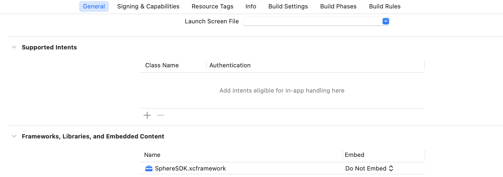
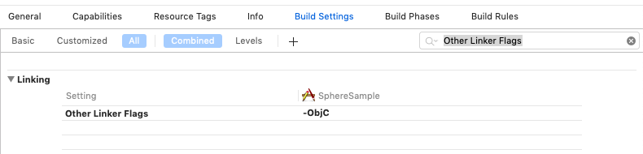

# Sphere Analytics - iOS

* [기본 연동](#기본-연동)
  * [Sphere Analytics 시작하기](#sphere-analytics-시작하기)
  * [SDK 다운로드](#sdk-다운로드)
  * [Xcode 프로젝트 설정](#xcode-프로젝트-설정)
  * [SDK 초기화하기](#sdk-초기화하기)
* [추가 기능](#추가-기능)
  * [사용자 이벤트 사용하기](#사용자-이벤트-사용하기)
  * [화면 자동 추적](#화면-자동-추적)
  * [사용자 세션 관리](#사용자-세션-관리)
  * [딥링크 분석](#딥링크-분석)
* [추가 설정](#추가-설정)
  * [로그 출력](#로그-출력)
  * [이벤트 수집 비활성화](#이벤트-수집-비활성화)
  * [웹뷰 설정](#웹뷰-설정)

## 기본 연동

### Sphere Analytics 시작하기

정상적인 Sphere Analytics 사용을 위해서는 아래 싸이트를 방문하여 회원 가입 후 앱을 등록하여 앱키를 발급받습니다.  
[준비중]  
[샘플 프로젝트](sample)를 참조하면 최신 버전의 Sphere SDK가 연동된 샘플 소스를 확인할 수 있습니다.

### SDK 다운로드

아래 싸이트를 방문하여 최신 버전의 SDK 파일(.framework)을 선택하여 다운로드 합니다.  
[다운로드 페이지](https://github.com/tand-git/ios-sdk/releases)

### Xcode 프로젝트 설정

1. 프로젝트 폴더 내에 Sphere SDK framework 파일(.framework)을 복사합니다.
2. 해당 프로젝트 내에 framework 파일을 추가합니다. (Add Files to ...)
3. '프로젝트 설정 > General > Linked Frameworks and Libraries' 에서 'SphereSDK.framework'가 추가되었는지 확인 후
만약 추가되지 않은 경우 'Linked Frameworks and Libraries > 추가(+) > Add Other...'를 통해 'SphereSDK.framework'를 추가합니다.

4. '프로젝트 설정 > General > BuildSettings > Linking > Other Linker Flags' 설정에 '-ObjC'를 추가합니다.  


### SDK 초기화하기

Sphere Analytics를 사용하기 위해서는 앱키가 필요합니다.  
(앱키가 없는 경우 Sphere Analytics 콘솔에서 앱을 등록하고 앱키를 발급 받습니다.)  
Sphere SDK 라이브러리를 프로젝트에 추가한 후 앱키와 함께 다음 코드와 같이 Sphere SDK를 초기화합니다.  

<AppDelegate.m>

```objectivec
@import SphereSDK;

@implementation AppDelegate

- (BOOL)application:(UIApplication *)application didFinishLaunchingWithOptions:(NSDictionary *)launchOptions {

    [SPRAnalytics configureWithAppKey:@"Your Sphere Analytics App Key"];

    return YES;
}

@end
```

<AppDelegate.swift>

```swift
import SphereSDK

@UIApplicationMain
class AppDelegate: UIResponder, UIApplicationDelegate {

    func application(_ application: UIApplication, didFinishLaunchingWithOptions launchOptions: [UIApplication.LaunchOptionsKey: Any]?) -> Bool {

        SphereApp.configure(appKey: "Your Sphere Analytics App Key");

        return true
    }
}
```

## 추가 기능

### 사용자 이벤트 사용하기

SDK가 초기화 되었다면 logEvent 함수를 이용하여 사용자 이벤트를 설정할 수 있으며, 한 이벤트는 최대 25개의 파라미터를 설정할 수 있습니다.  
파라미터는 파라미터명과 파라미터값의 쌍으로 구성되며 SPRParamBuilder 클래스를 통해 설정이 가능합니다.  

이벤트명과 파라미터에 관한 규칙은 다음과 같습니다.

1. 이벤트명
    * 최대 40자  
    * 영문 대소문자, 숫자, 특수문자 중 ‘_’ 만 허용  
    * 첫 글자는 영문 대소문자만 허용

2. 파라미터명
    * 최대 40자  
    * 영문 대소문자, 숫자, 특수 문자 중 ‘_’ 만 허용  
    * 첫 글자는 영문 대소문자만 허용

3. 파라미터값
    * 지원 타입 : NSString(최대 100자), int, long, float, double, BOOL

<.m>

```objectivec
SPRParamBuilder *paramBuilder = [SPRParamBuilder builder];
[paramBuilder setParamWithString:@"notebook" forName:@"item"];
[paramBuilder setParamWithLong:1 forName:@"quantity"];
[paramBuilder setParamWithDouble:9.9 forName:@"price"];

[SPRAnalytics logEventWithName:@"purchase" paramBuilder:paramBuilder];
```

<.swift>

```swift
let paramBuilder = SPRParamBuilder()
    .setStringParam("notebook", forName: "item")
    .setLongParam(1, forName: "quantity")
    .setDoubleParam(9.9, forName: "price")

SphereAnalytics.logEvent("purchase", paramBuilder: paramBuilder)
```

### 화면 자동 추적

앱이 실행되고 이후 전환되는 화면(UIViewController)을 자동으로 추적하여 이벤트를 기록합니다.

* 이벤트명 : "#page"
* 파라미터 : {"pageClass":"UIViewController 상속 클래스명"}

아래 코드를 통해 자동 화면 추적 기능을 비활성화 할 수 있습니다. (기본 설정: 활성화)

<.m>

```objectivec
[SPRAnalytics setPageTrackingEnabled:false]; // 비활성화
```

<.swift>

```swift
SphereAnalytics.setPageTrackingEnabled(false) // 비활성화
```

### 사용자 세션 관리

사용자 세션 정보를 위한 신규 세션 생성 규칙은 다음과 같으며, 신규 세션 시작 시 "#session" 이벤트가 기록됩니다.

* 앱이 비활성화 상태에서 활성화 상태로 변경 시 타임아웃 시간(기본 설정: 30분)이 경과한 후에만 신규 세션 시작  
* 앱이 활성화 시 이전 세션의 시작 시간과 날짜가 변경된 경우 신규 세션 시작  

아래 코드를 통해 사용자 세션 타임아웃 시간을 변경할 수 있습니다. (기본 설정: 30분)  

<.m>

```objectivec
[SPRAnalytics setSessionTimeoutInterval:60]; // 1분
```

<.swift>

```swift
SphereAnalytics.setSessionTimeoutInterval(60) // 1분
```

### 딥링크 분석

앱에서 Custom URL Scheme 또는 Universal Link를 사용하여 앱을 실행하는 경우 다음 코드와 같이 앱이 실행된 URL 정보를 Sphere Analytics로 전달합니다.  

#### 1. URL Scheme을 사용한 앱 실행 시

<AppDelegate.m>

```objectivec
@implementation AppDelegate

- (BOOL)application:(UIApplication *)app openURL:(NSURL *)url options:(NSDictionary<UIApplicationOpenURLOptionsKey,id> *)options {

    [SPRAnalytics handleOpenUrl:url];

    return YES;
}

@end
```

<AppDelegate.swift>

```swift
@UIApplicationMain
class AppDelegate: UIResponder, UIApplicationDelegate {

    func application(_ app: UIApplication, open url: URL, options: [UIApplication.OpenURLOptionsKey : Any] = [:]) -> Bool {

        SphereAnalytics.handleOpen(url)

        return true
    }
}
```

#### 2. Universal Link를 사용한 앱 실행 시

<AppDelegate.m>

```objectivec
@implementation AppDelegate

- (BOOL)application:(UIApplication *)application continueUserActivity:(NSUserActivity *)userActivity restorationHandler:(void (^)(NSArray<id<UIUserActivityRestoring>> *restorableObjects))restorationHandler {

    [SPRAnalytics handleContinueUserActivity:userActivity];

    return YES;
}

@end
```

<AppDelegate.swift>

```swift
@UIApplicationMain
class AppDelegate: UIResponder, UIApplicationDelegate {

    func application(_ application: UIApplication, continue userActivity: NSUserActivity, restorationHandler: @escaping ([UIUserActivityRestoring]?) -> Void) -> Bool {

        SphereAnalytics.handleContinue(userActivity)

        return true;
    }
}
```

## 추가 설정

### 로그 출력

Sphere Analytics 연동이 완료된 후 로그 출력 함수를 활성화 하면 세션의 시작과 종료 및 이벤트 정보의 로그를 확인할 수 있습니다.
기본 설정은 비활성화 상태입니다.

<.m>

```objectivec
[SPRAnalytics enableLog:true]; // 활성화
```

<.swift>

```swift
SphereAnalytics.enableLog(true) // 활성화
```

### 이벤트 수집 비활성화

Sphere Analytics의 이벤트 수집 기능을 비활성화하기를 원할 경우 아래와 같은 코드를 추가합니다.
기본 설정은 활성화 상태이며, 비활성화된 이후로는 다시 활성화하기 전까지 Sphere Analytics 관련 기능이 동작하지 않습니다.

<.m>

```objectivec
[SPRAnalytics setAnalyticsCollectionEnabled:false]; // 비활성화
```

<.swift>

```swift
SphereAnalytics.setAnalyticsCollectionEnabled(false) // 비활성화
```

### 웹뷰 설정

웹뷰를 이용한 하이브리드앱을 개발하는 경우 사용자 이벤트를 수집하기 위해서는 자바스크립트 인터페이스 핸들러를 통해 네이티브 API를 호출해야 합니다.  
[샘플 프로젝트](sample)를 참조하면 웹뷰를 통해 연동된 샘플 소스를 확인할 수 있습니다.

#### 1. 웹뷰 스크립트 메세지 핸들러 등록

웹뷰에 스크립트 메세지 핸들러를 등록하여 웹에서 호출하는 자바스크립트 이벤트를 네이티브 인터페이스로 맵핑합니다.

<ViewController.m>

```objectivec
@interface ViewController () <WKScriptMessageHandler>
@property (nonatomic, readonly) WKWebView *webView;
@end

@implementation ViewController

- (void)viewDidLoad {
    [super viewDidLoad];

    // Initialize the webview and add self as a script message handler.
    WKWebViewConfiguration *configuration = [[WKWebViewConfiguration alloc] init];
    WKUserContentController *controller = [[WKUserContentController alloc] init];

    [controller addScriptMessageHandler:self name:@"sphere"];
    configuration.userContentController = controller;
    _webView = [[WKWebView alloc] initWithFrame:[UIScreen mainScreen].bounds configuration:configuration];
    [self.view addSubview:self.webView];

    // Navigate to site
    NSURLRequest *request = [NSURLRequest requestWithURL:[NSURL URLWithString:@"your website url"]];
    [self.webView loadRequest:request];
}

- (void)userContentController:(WKUserContentController *)userContentController
      didReceiveScriptMessage:(WKScriptMessage *)message {

    [SPRScriptMessageHandler handleReceiveScriptMessage:message];
}
@end
```

<ViewController.swift>

```swift
class ViewController: UIViewController, WKScriptMessageHandler {
    private var webView: WKWebView!

    override func viewDidLoad() {
        super.viewDidLoad()

        // Initialize the webview and add self as a script message handler.
        self.webView = WKWebView(frame: self.view.frame)
        self.webView.configuration.userContentController.add(self, name: "sphere")
        self.view.addSubview(self.webView)

        // Navigate to site
        let request = URLRequest(url: URL(string: "your website url")!)
        self.webView.load(request)
    }

    func userContentController(_ userContentController: WKUserContentController,
                               didReceive message: WKScriptMessage) {

        SPRScriptMessageHandler.handleReceive(message)
    }
}
```

#### 2. 자바스크립트 인터페이스

아래 코드와 같이 자바스크립트를 위한 인터페이스를 추가합니다.

<.js>

```javascript
// User event function
// name : Event Name
// params : Parameter of JSON type
function logEvent(name, params) {
  if (window.SphereJsInterface) {
    // Call Android interface
    window.SphereJsInterface.logEvent(name, JSON.stringify(params));
  } else if (window.webkit
      && window.webkit.messageHandlers
      && window.webkit.messageHandlers.sphere) {
    // Call iOS interface
    var message = {
      command: 'logEvent',
      name: name,
      parameters: params
    };
    window.webkit.messageHandlers.sphere.postMessage(message);
  } else {
    // No Android or iOS interface found
    console.log("No native APIs found.");
  }
}
```
