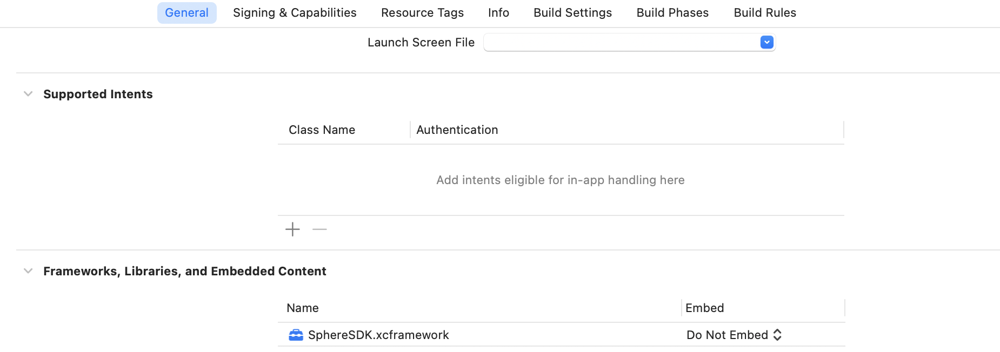

# Sphere iOS SDK

* [기본 연동](#기본-연동)
    * [Sphere Analytics 시작하기](#sphere-analytics-시작하기)
    * [샘플 소스 및 연동 검증 가이드](#샘플-소스-및-연동-검증-가이드)
    * [SDK 다운로드](#sdk-다운로드)
    * [Xcode 프로젝트 설정](#xcode-프로젝트-설정)
    * [SDK 초기화하기](#sdk-초기화하기)
* [웹뷰 연동](#웹뷰-연동)
    * [웹뷰 자바스크립트 메세지 핸들러 등록](#웹뷰-자바스크립트-메세지-핸들러-등록)
    * [웹뷰 WebSDK 이용하기](#웹뷰-WebSDK-이용하기)
* [이벤트 연동하기](#이벤트-연동하기)
* [사용자 속성 연동하기](#사용자-속성-연동하기)
    * [사용자 아이디 설정](#사용자-아이디-설정)
    * [사용자 속성 설정](#사용자-속성-설정)
    * [커스텀 사용자 속성 설정](#커스텀-사용자-속성-설정)
    * [커스텀 사용자 포인트 설정](#커스텀-사용자-포인트-설정)
* [추가 설정](#추가-설정)
    * [로그 출력](#로그-출력)
    * [이벤트 즉시 전송](#이벤트-즉시-전송)
    * [이벤트 수집 비활성화](#이벤트-수집-비활성화)
    * [Sphere ID 확인](#Sphere-ID-확인)
* [PushMessage 연동](#pushmessage-연동)
* [인앱메세지 설정](#인앱메세지-설정)

## 기본 연동

> SDK 기본 연동은 이벤트 수집을 위한 필수 연동 사항이며 보다 정확한 이벤트 분석 및 트래킹을 위해서는 기본 연동에 포함된 가이드 중 해당되는 모든 항목들의 연동이 필요합니다.

### Sphere Analytics 시작하기

Sphere Analytics 사용을 위해서는 기본적으로 앱키(App key)가 필요합니다.  
앱키가 없는 경우 Sphere Analytics 콘솔([https://analytics.tand.kr](https://analytics.tand.kr), Chrome 브라우저 활용)을 방문하여 회원 가입 및 로그인 후 앱등록 단계에서 앱키를 발급받습니다.

### 샘플 소스 및 연동 검증 가이드

* [SDK 샘플 소스](sample) : 최신 버전의 Sphere SDK가 연동된 샘플 소스를 확인할 수 있습니다.
* [SDK 연동 검증 가이드(스피어 대시보드)](https://lightning-individual-9c1.notion.site/0ad122054a0d44e59166a90a3c48e8e2) : 기본 연동이 완료되었다면, 이후 스피어 대시보드에서 태깅된 내용을 확인할 수 있습니다.
* [SDK 연동 로그 확인](#로그-출력) : 기본 연동이 완료되었다면, 로그레벨을 설정하여 SDK 동작 상태를 확인할 수 있습니다.

### SDK 다운로드

SDK 라이브러리를 다운로드하기 위해서는 [SDK 다운로드 페이지](https://github.com/tand-git/ios-sdk/releases)를 방문하면 현재까지 릴리즈된 SDK 버전들을 확인할 수 있으며 가장 최신 버전의 SDK 파일(SphereSDK.framework.zip)을 선택하여 다운로드 후 압축을 해제합니다.

### Xcode 프로젝트 설정
>> #### iOS SDK 설치하기
> 1. 프로젝트 폴더 내에 Sphere SDK framework 파일(.framework)을 복사합니다.
> 2. 해당 프로젝트 내에 framework 파일을 추가합니다. (Add Files to ...)
> 3. '프로젝트 설정 > General > Linked Frameworks and Libraries' 에서 'SphereSDK.framework'가 추가되었는지 확인 후
     만약 추가되지 않은 경우 'Linked Frameworks and Libraries > 추가(+) > Add Other...'를 통해 'SphereSDK.framework'를 추가합니다.
     
> 4. '프로젝트 설정 > General > BuildSettings > Linking > Other Linker Flags' 설정에 '-ObjC'를 추가합니다.  
     
>
> >#### Dependency framework 설치하기
> 1. '프로젝트 설정 > General > Linked Frameworks and Libraries, and Embedded Content'에서 표의 framework목록 중 미설치된 항목을 추가합니다.
>
> |제목|내용|
> |---|-----|
> |AdSupport.framework| IDFA 를 수집|
> |CoreTelephony.framework| 통신사 정보를 수집|
> |AppTrackingTransparency.framework| 추적 허용 상태정보를 수집|
>
>>#### 앱 추적 투명성 허가(App Tracking Transparency) 받기
> * ‘iOS 14.5, iPadOS 14.5 및 tvOS 14.5 이후 버전에서는 타사 소유의 앱과 웹 사이트 전반에서 사용자를 추적하려면 앱에서 사용자에게 허가를 받아야 합니다. Sphere Analytics에서는 IDFA를 분석, 검증(테스트), 액션에 활용합니다.’
> 1.  IDFA에 액세스하기 위한 앱 추적 투명성 승인 요청을 표시하려면 Info.plist를 업데이트하여 사용을 설명하는 맞춤 메시지와 함께 NSUserTrackingUsageDescription 키를 추가합니다
>
>  `<Info.plist>`
> ```
>[텍스트는 예시이며, 변경하여 사용을 권장합니다]
><key>NSUserTrackingUsageDescription</key>
><string>App would like to access IDFA for tracking purpose.[텍스트는 예시이며, 변경하여 사용을 권장]</string>
>```
>
> 2. 사용자 추적허용 팝업표기
> * 아래의 코드는 예시이며, ATTrackingManager.requestTrackingAuthorization 코드의 실행을 위함입니다.
> * 권한 허용 팝업을 띄우고자 하는 시점에 호출합니다.
>
> `<Swift>`
> ```swift
> import AppTrackingTransparency
> import AdSupport
> ...
> func getTrackingAllowPopup() {
>    if #available(iOS 14, *) {
>        ATTrackingManager.requestTrackingAuthorization(completionHandler: { status in
>            // 추적이 허용이 되면. 이 부분에서 IDFA 값을 확인 가능합니다.
>            // let idfa = ASIdentifierManager.shared().advertisingIdentifier.uuidString
>        })
>    }
>}
>```
> `<Objective-C>`
> ```objectivec
> #import <AppTrackingTransparency/AppTrackingTransparency.h>
> #import <AdSupport/AdSupport.h>
> ...
> - (void)getTrackingAllowPopup {
>    if (@available(iOS 14, *)) {
>        [ATTrackingManager requestTrackingAuthorizationWithCompletionHandler:^(ATTrackingManagerAuthorizationStatus status) {
>            // 추적이 허용이 되면. 이 부분에서 IDFA 값을 확인 가능합니다.
>            // NSString *idfa = [[[ASIdentifierManager sharedManager] advertisingIdentifier] UUIDString];
>      }];
>    }
> }
> ```
> *  firebase - 앱 추적 투명성(App Tracking Transparency) 승인 요청 가이드 :
     >   https://developers.google.com/admob/ios/ios14?hl=ko#request

### SDK 초기화하기

Sphere SDK 라이브러리를 프로젝트에 추가하였다면 다음 코드와 같이 앱키와 함께 Sphere SDK를 초기화합니다.  
앱키가 없는 경우 [Sphere Analytics 시작하기](#sphere-analytics-시작하기)을 참고하여 앱키를 발급받습니다.

`<Objective-C> - AppDelegate.m`

```objectivec
@import SphereSDK;

@implementation AppDelegate

- (BOOL)application:(UIApplication *)application didFinishLaunchingWithOptions:(NSDictionary *)launchOptions {

    // Sphere Analytics SDK 초기화
    [SPRAnalytics configureWithAppKey:@"Your Sphere Analytics App Key"];

    return YES;
}

@end
```

`<Swift> - AppDelegate.swift`

```swift
import SphereSDK

@UIApplicationMain
class AppDelegate: UIResponder, UIApplicationDelegate {

    func application(_ application: UIApplication, didFinishLaunchingWithOptions launchOptions: [UIApplication.LaunchOptionsKey: Any]?) -> Bool {

        // Sphere Analytics SDK 초기화
        SphereAnalytics.configure(appKey: "Your Sphere Analytics App Key")

        return true
    }
}
```

## 웹뷰 연동

> 웹뷰를 이용하는 웹앱의 경우 웹뷰 연동은 필수사항입니다.

웹뷰를 이용한 웹앱의 경우 이벤트를 수집하기 위해서는 자바스크립트 인터페이스 핸들러를 통해 네이티브 API를 호출해야 합니다.  
[샘플 소스](sample)를 참조하면 웹뷰를 통해 연동된 전체 샘플 소스를 확인할 수 있습니다.

### 웹뷰 자바스크립트 메세지 핸들러 등록

웹뷰에 스크립트 메세지 핸들러를 등록하여 웹에서 호출하는 Sphere 자바스크립트 인터페이스를 Sphere 네이티브 인터페이스로 연결합니다.  
관련 샘플 소스는 [SampleWebViewController.m](sample/SphereSample/SampleWebViewController.m) 또는 [SampleWebViewController.swift](sample/SphereSampleSwift/SampleWebViewController.swift)에서 확인할 수 있습니다.

`<Objective-C>`

```objectivec
// Add a script message handler for Sphere Analytics
[self.webView.configuration.userContentController addScriptMessageHandler:[[SPRScriptMessageHandler alloc] initWithWebView:_webView] name:@"sphere"];
```

`<Swift> - ViewController.swift`

```swift
// Add a script message handler for Sphere Analytics
self.webView.configuration.userContentController.add(SPRScriptMessageHandler(webView:webView), name: "sphere")
```

### 웹뷰 WebSDK 이용하기

기본 연동 및 웹뷰 연동이 정상적으로 완료되었다면 웹뷰를 이용한 웹 환경에서 Web SDK를 통해 이벤트 수집이 가능합니다.  
Web SDK를 이용하기 위해서는 [Sphere Web SDK 연동 가이드](https://github.com/tand-git/web-sdk)를 참고하시기 바랍니다.

> 아래의 '이벤트 연동하기'부터는 네이티브 영역을 대상으로 진행되는 내용입니다.

## 이벤트 연동하기

> 이벤트는 가장 기본이 되는 수집 정보이며 이벤트는 이벤트명과 파라미터들로 구성이 됩니다.

> 이벤트 연동 검증 방법 : [SDK 연동 검증 가이드](https://lightning-individual-9c1.notion.site/0ad122054a0d44e59166a90a3c48e8e2) | [로그 출력](#로그-출력)

SDK가 초기화 되었다면 `logEvent` 함수를 이용하여 이벤트를 연동할 수 있으며, 한 이벤트는 최대 25개의 파라미터를 설정할 수 있습니다.
파라미터는 파라미터명과 파라미터값의 쌍으로 구성되며 `SPRParamBuilder` 클래스를 통해 설정이 가능합니다.


이벤트명은 필수이며 파라미터는 없는 경우 `nil`로 설정 가능합니다. 이벤트명과 파라미터에 관한 규칙은 다음과 같습니다.

1. 이벤트명
    * 최대 40자
    * 영문 대소문자, 숫자, 특수문자 중 ‘_’ 만 허용
    * 첫 글자는 영문 대소문자만 허용

2. 파라미터명
    * 최대 40자
    * 영문 대소문자, 숫자, 특수 문자 중 ‘_’ 만 허용
    * 첫 글자는 영문 대소문자만 허용

3. 파라미터값
    * 지원 타입 : NSString(최대 100자), long, double,
    * SDK v1.2.10 이상 : NSMutableArray(String) 추가지원


`<Objective-C>`

```objectivec
// 파라미터를 포함한 이벤트 기록
SPRParamBuilder *paramBuilder = [SPRParamBuilder builder];
[paramBuilder setParamWithString:@"param_value" forName:@"param_name_1"];
[paramBuilder setParamWithLong:1 forName:@"param_name_2"];
[paramBuilder setParamWithDouble:9.9 forName:@"param_name_3"];

// 파라미터 array<String>: SDK v1.2.10 이상
NSMutableArray* paramArr = [[NSMutableArray alloc] init];
[paramArr addObject:@"value1"];
[paramBuilder setParamWithArray:paramArr forName:@"param_name_4"];

[SPRAnalytics logEventWithName:@"event_name_1" paramBuilder:paramBuilder];

// 파라미터가 없는 이벤트 기록
[SPRAnalytics logEventWithName:@"event_name_2" paramBuilder:nil];
```

`<Swift>`

```swift
// 파라미터를 포함한 이벤트 기록
let paramBuilder = SPRParamBuilder()
    .setStringParam("param_value", forName: "param_name_1")
    .setLongParam(1, forName: "param_name_2")
    .setDoubleParam(9.9, forName: "param_name_3")
//  .setParamArray(paramArr, forName: "param_name_4") //SDK v1.2.10 이상

// 파라미터 array<String>: SDK v1.2.10 이상
var paramArr = Array<String>()
paramArr.append("value1")

paramBuilder.setParamArray(paramArr ,forName:"param_name_4")

SphereAnalytics.logEvent("event_name_1", paramBuilder: paramBuilder)

// 파라미터가 없는 이벤트 기록
SphereAnalytics.logEvent("event_name_2", paramBuilder: nil)
```

## 사용자 속성 연동하기

> 사용자 속성을 사용할 경우 수집된 이벤트들을 세분화하여 더욱 자세한 분석 정보를 얻을 수 있으며 개인 정보들은 암호화되어 서버에 저장됩니다. 사용자 속성들은 한번 설정되면 이후 재설정 또는 초기화될 때까지 설정된 값으로 유지됩니다.

사용자 속성 연동 시 고려해야 할 사항은 다음과 같으며 해당되는 모든 시점에 사용자 속성들을 설정해야 정확한 분석이 가능합니다.

1. (필수) 실행 후 현재 로그인 여부를 알 수 있는 가장 빠른 시점에 로그온 또는 로그오프 상태에 따라 사용자 아이디 및 사용자 속성을 설정 또는 초기화
2. 로그인 또는 로그아웃 상태 변경 시 해당 상태에 따라 해당 사용자 아이디 및 사용자 속성을 설정 또는 초기화

### 사용자 아이디 설정

사용자 아이디는 고객이 고객사의 서비스에 로그인할 때 사용되는 아이디가 아니라, 고객사의 시스템에서 사용자를 관리하는 고유한 식별값을 의미합니다.
고유한 사용자를 구분하기 위한 사용자 아이디로서 설정 여부에 따라 로그인 여부를 판단합니다.  
해당 정보는 유저를 구분하기 위한 용도로만 사용되므로 사용자를 식별하는 고유한 (Unique) 어떠한 식별 아이디도 사용 가능합니다.  
사용자 아이디는 최대 256자까지 설정가능하고 `nil`로 설정 시 사용자 아이디 정보는 초기화되고 로그아웃 상태로 설정됩니다.

`<Objective-C>`

```objectivec
if (isLogIn) { // 로그인: ON 상태

    // 사용자 아이디 설정
    [SPRAnalytics setUserId:@"[USER ID]"];

} else { // 로그아웃: OFF 상태

    // 사용자 아이디 초기화
    [SPRAnalytics setUserId:nil];
}
```

`<Swift>`

```swift
if (isLogIn) { // 로그인: ON 상태

    // 사용자 아이디 설정
    SphereAnalytics.setUserId("[USER ID]")

} else { // 로그아웃: OFF 상태

    // 사용자 아이디 초기화
    SphereAnalytics.setUserId(nil)
}
```

### 사용자 속성 설정

추가적인 사용자 속성(보유 포인트, 등급, 성별, 출생년도)를 설정합니다.  
로그아웃 상태 시 다음과 같이 설정된 사용자 속성들을 초기화해야 합니다.

1. 문자형(등급, 성별) 초기화 : `nil`로 설정
2. 숫자형(보유 포인트) 초기화 : `removePoints` 함수 호출
3. 숫자형(출생년도) 초기화 : `0`으로 설정


`<Objective-C>`

```objectivec
if (isLogIn) { // 로그인: ON 상태 및 사용자 속성 변경 시 설정

    // 사용자 아이디 설정
    [SPRAnalytics setUserId:@"[USER ID]"];

    // 보유 포인트 설정
    [SPRAnalytics setRemainingPoint:1000];
    // 등급 설정
    [SPRAnalytics setGrade:@"vip"];
    // 성별 설정
    [SPRAnalytics setGender:@"m"]; // 남성: "m", 여성: "f"
    // 출생년도 설정
    [SPRAnalytics setBirthYear:1995];


} else { // 로그아웃: OFF 상태

    // 사용자 아이디 초기화
    [SPRAnalytics setUserId:nil];

    // 보유 포인트 초기화
    [SPRAnalytics removePoints];
    // 등급 초기화
    [SPRAnalytics setGrade:nil];
    // 성별 초기화
    [SPRAnalytics setGender:nil];
    // 출생년도 초기화
    [SPRAnalytics setBirthYear:0];
    

}
```

`<Swift>`

```swift
if (isLogIn) { // 로그인: ON 상태 및 사용자 속성 변경 시 설정

    // 사용자 아이디 설정
    SphereAnalytics.setUserId("[USER ID]")

    // 보유 포인트 설정
    SphereAnalytics.setRemainingPoint(1000)
    // 등급 설정
    SphereAnalytics.setGrade("vip")
    // 성별 설정
    SphereAnalytics.setGender("m") // 남성: "m", 여성: "f"

    // 출생년도 설정
    SphereAnalytics.setBirthYear(1995) // 출생년도

} else { // 로그아웃: OFF 상태

    // 사용자 아이디 초기화
    SphereAnalytics.setUserId(nil)

    // 보유 포인트 초기화
    SphereAnalytics.removePoints()
    // 등급 초기화
    SphereAnalytics.setGrade(nil)
    // 성별 초기화
    SphereAnalytics.setGender(nil)
    // 출생년도 초기화
    SphereAnalytics.setBirthYear(0)


}
```

### 커스텀 사용자 속성 설정

미리 정의되지 않은 사용자 속성 정보를 사용 시 `setUserProperty`(문자형) 또는 `setUserPropertyLong`(정수형) 함수를 이용하여 커스텀 사용자 속성을 설정할 수 있습니다.  
사용자 속성은 속성명과 속성값의 쌍으로 구성되며 사용자 속성 정보 초기화 시 `removeUserProperty` 함수를 이용하여 초기화가 가능합니다.
또한 문자형 사용자 속성의 경우 속성값을 `null`로 설정 시 해당 속성은 초기화 됩니다.

(단, 개인정보는 전달하면 안됩니다. ex: 생년월일, 전화번호, e-mail 등)
사용자 속성에 관한 규칙은 다음과 같습니다.

1. 사용자 속성명
    * 최대 40자
    * 영문 대소문자, 숫자, 특수문자 중 ‘_’ 만 허용
    * 첫 글자는 영문 대소문자만 허용
    * "sap"으로 시작되는 속성명은 사전 정의된 속성명으로 사용 불가

2. 사용자 속성값
    * 문자형 : 최대 100자
    * 정수형 : long 타입
    * 배열형 : NSMutableArray(String) //SDK v1.2.10 이상


`<Objective-C>`

```objectivec
// 커스텀 사용자 속성 설정
[SPRAnalytics setUserProperty:@"user_property_value" forName:@"user_property_name_1"];
[SPRAnalytics setUserPropertyLong:12345 forName:@"user_property_name_2"];
// 커스텀 사용자 속성 초기화
[SPRAnalytics removeUserProperty:@"user_property_name_1"];
[SPRAnalytics removeUserProperty:@"user_property_name_2"];

// 배열속성 설정: SDK v1.2.10 이상
// NSArray *arrProp = [NSArray arrayWithObjects:@"prop1", @"prop2", @"prop3", nil]; // 사용가능
NSMutableArray* arrProp = [[NSMutableArray alloc] init];
[arrProp addObject:@"prop1"];
[SPRAnalytics setUserPropertyArray:arrProp forName:@"user_property_arr"];
    
// 배열속성 초기화 : SDK v1.2.10 이상
[SPRAnalytics setUserPropertyArray:nil forName:@"user_property_arr"];
```

`<Swift>`

```swift
// 커스텀 사용자 속성 설정
SphereAnalytics.setUserProperty("user_property_value", forName: "user_property_name_1")
SphereAnalytics.setUserPropertyLong(1234, forName: "user_property_name_2")
// 커스텀 사용자 속성 초기화
SphereAnalytics.removeUserProperty("user_property_name_1")
SphereAnalytics.removeUserProperty("user_property_name_2")

// 배열 속성 설정 : SDK v1.2.10 이상
// NSArray *arrProp = ["prop1","prop2","prop3"]; // 사용가능
var arrProp = Array<String>()
arrProp.append("prop1")
SphereAnalytics.setUserPropertyArray(arrProp, forName: "user_property_arr")

// 배열 속성 초기화 : SDK v1.2.10 이상
SphereAnalytics.setUserPropertyArray(nil, forName: "user_property_arr")
```

### 커스텀 사용자 포인트 설정

미리 정의되지 않은 사용자 속성 정보를 사용 시 `setRemainingPoint`(보유 포인트) 함수를 이용하여 커스텀 사용자 포인트를 설정할 수 있습니다.  
사용자 속성은 속성명과 속성값의 쌍으로 구성되며 사용자 속성 정보 초기화 시 `removePoints` 함수를 이용하여 초기화가 가능합니다.
또한 사용자의 전체 포인트를 초기화하는 경우 `resetPoints`함수를 이용하여 초기화 가능합니다.

1. 사용자 속성값
    * 최대 100자
    * 지원 타입 : String

2. 사용자 속성명
    * 최대 40자
    * 영문 대소문자, 숫자, 특수문자 중 ‘_’ 만 허용
    * 첫 글자는 영문 대소문자만 허용
    * setRemainingPoint(포인트) 함수사용 시 "point"로 사전 정의된 포인트명임으로 사용 불가

```js
// 커스텀 사용자 속성 설정
SphereAnalytics.setRemainingPoint( 1234567, "user_point_name");
// 커스텀 사용자 속성 초기화
SphereAnalytics.removePoints("user_point_name");
// 사용자 포인트 전체 초기화(기본포인트 + 커스텀포인트)
SphereAnalytics.resetPoints();
```

## 추가 설정

> 추가 설정은 필수적인 연동 사항은 아니며 필요한 경우 선택적으로 사용이 가능합니다.

### 로그 출력

> 로그 출력 함수를 활성화 하면 세션의 시작과 종료 및 이벤트 기록 로그와 에러 로그들을 확인할 수 있습니다.  
> 기본 설정은 비활성화 상태이며, 서버로 전송된 데이터 확인은 [SDK 연동 검증 가이드(스피어 대시보드)](https://lightning-individual-9c1.notion.site/0ad122054a0d44e59166a90a3c48e8e2)를 참조바랍니다.

`<Objective-C>`

```objectivec
[SPRAnalytics enableLog:true]; // 활성화
```

`<Swift>`

```swift
SphereAnalytics.enableLog(true) // 활성화
```

### 이벤트 즉시 전송

기본적으로 Sphere Analytics는 앱이 실행된 후 비활성화되는 시점에 자동으로 기록된 모든 이벤트들을 서버에 전송합니다.  
하지만 `requestUpload` 함수를 호출할 경우 호출 시점까지 기록된 모든 이벤트들을 즉시 서버로 전송이 가능하며 해당 시점에 즉시 이벤트 수집이 필요한 경우에만 사용하기를 권장합니다.

`<Objective-C>`

```objectivec
[SPRAnalytics requestUpload];
```

`<Swift>`

```swift
SphereAnalytics.requestUpload()
```

### 이벤트 수집 비활성화

Sphere Analytics의 이벤트 수집 기능을 비활성화하기를 원할 경우 아래와 같은 코드를 추가합니다.
기본 설정은 활성화 상태이며 비활성화된 이후로는 다시 활성화하기 전까지 이벤트가 수집되지 않습니다.

`<Objective-C>`

```objectivec
[SPRAnalytics setAnalyticsCollectionEnabled:false]; // 비활성화
```

`<Swift>`

```swift
SphereAnalytics.setAnalyticsCollectionEnabled(false) // 비활성화
```

### Sphere ID 확인

Sphere ID는 Sphere에서 기기를 식별하는 고유한 식별자로서 앱 설치 시 SDK 내부에서 항상 새롭게 생성이 되므로 삭제 후 재설치 시 새로운 Sphere ID가 생성이 됩니다.  
Sphere ID를 확인하기 위해서는 `sphereId` 함수를 호출하여 SDK로부터 Sphere ID를 가져온 후 로그를 출력하여 확인할 수 있습니다.

`<Objective-C>`

```objectivec
NSString *sphereId = [SPRAnalytics sphereId];
NSLog(@"Sphere ID: %@", sphereId);
```

`<Swift>`

```swift
let sphereId = SphereAnalytics.sphereId()
NSLog("Sphere ID: %@", sphereId)
```
### PushMessage 연동
>[iOS Sphere Push Message 연동 가이드](https://github.com/tand-git/ios-sdk/blob/master/message/PushMessage.md)

### 인앱메세지 설정

인앱메세지는 웹뷰 기반으로 앱에서는 다음과 같은 설정이 필요합니다.[웹뷰 자바스크립트 메세지 핸들러 등록](#웹뷰-자바스크립트-메세지-핸들러-등록)

인앱메세지 사용설정은 WebSDK에서 설정에서 진행됩니다.[WebSDK 인앱메세지 설정](https://github.com/tand-git/web-sdk#인앱메세지-설정)